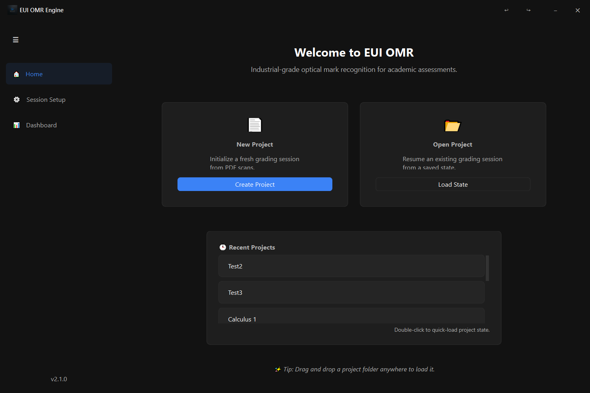
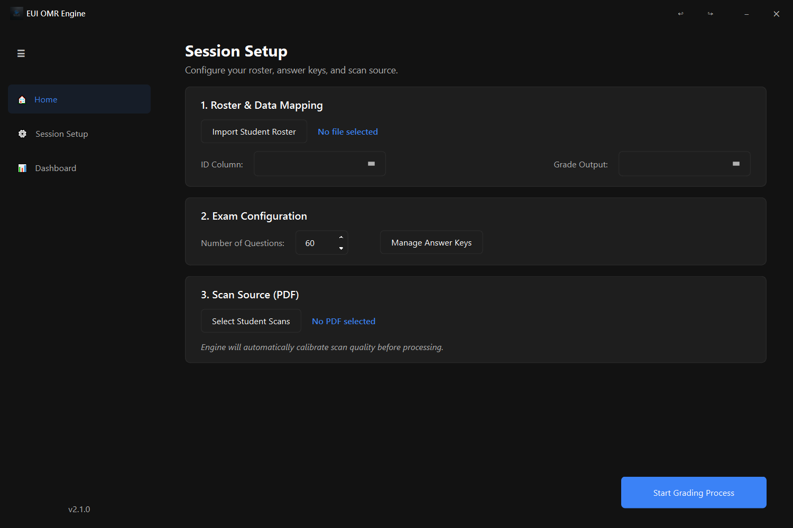
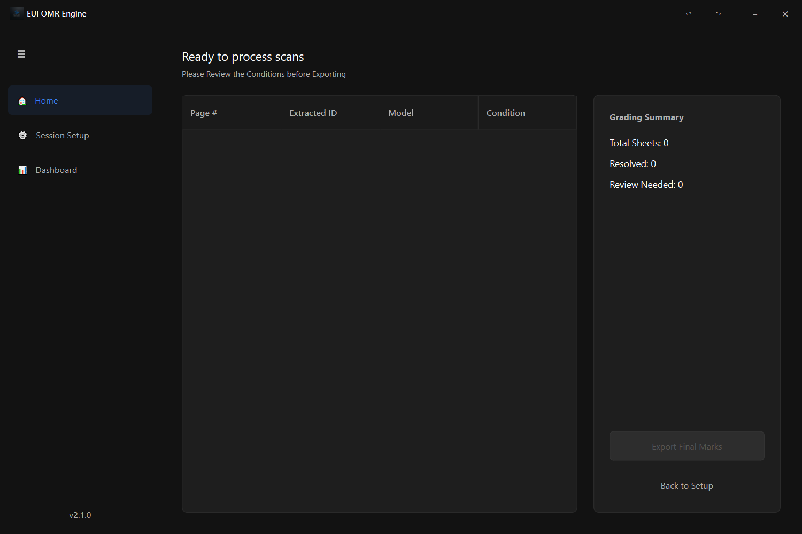

# EUI OMR Engine - Professional Grading & Research Platform

EUI OMR Engine is an industrial-grade Optical Mark Recognition (OMR) system designed to eliminate the high costs and logistical constraints of traditional grading hardware. It provides a standardized solution for extracting data from scanned bubble sheets using regular office equipment.

## 📸 Visual Overview

| Welcome & Project Selection | Session Setup & Calibration | Results Dashboard |
|:---:|:---:|:---:|
|  |  |  |

## 🎯 The Problem & Our Solution

Traditional OMR systems often trap educational institutions in expensive ecosystems:
- **Requirement for specialized, high-cost paper** and rigid templates.
- **Dependency on proprietary hardware** (OMR scanners) that are expensive to maintain.
- **Inflexible workflows** requiring manual sorting of exam models.

**EUI OMR Engine** overcomes these limitations by utilizing Computer Vision to process standard A4 paper scanned by any regular office printer. It automates model detection, handles page orientation, and provides an integrated environment for data validation.

## 🌟 Key Features

- **Hardware & Media Independence**: Works with standard **A4 paper** and any **document scanner**.
- **Premium SaaS Dashboard**: A world-class interface featuring a **Sidebar-Dashboard** architecture and industrial dark-mode aesthetic.
- **Smooth Animation Engine**: High-performance **Sliding Fade** transitions at a buttery-smooth 60 FPS.
- **Automatic Model Detection**: Scans mixed batches of exam versions (e.g., Form A, B, C) simultaneously.
- **Intelligent Page Orientation**: Automatically corrects page rotation and skew.
- **Integrated Manual Review**: A dedicated UI for resolving ambiguities with physical crop verification.
- **Global Data Guard (Mirroring)**: Automatically clones student scans into the project directory for total portability.

## 📄 Documentation
For a deep technical dive into the algorithms, architecture, and OMR logic, please refer to the:
- **[Professional Technical Manual (PDF)](manual.pdf)**

## 🛠️ Technical Stack
- **Vision**: `opencv-python`, `PyMuPDF` (Computer Vision & PDF Processing)
- **GUI**: `PySide6` (Qt for Python)
- **Data**: `pandas`, `openpyxl` (Excel Automation & Management)

## 📁 Project Structure
- `src/core`: OMR Grading Engine, Project Management & Calibration logic.
- `src/ui`: PySide6 Dashboard, Manual Review Modals, and Async Workers.
- `assets/`: Application branding, icons, and production screenshots.
- `manual.pdf`: The complete industrial-grade technical documentation.
- `template.tex`: LaTeX source for customizable EUI bubble sheet designs.

## 🚀 Getting Started

### 1. Installation
```bash
pip install -r requirements.txt
```

### 2. Launching the App
```bash
python main_entry.py
```

### 3. Workflow
1. **Create/Load Project**: Note: Project folders are fully portable!
2. **Setup**: Import student roster (Excel) and define answer keys.
3. **Calibrate**: Run "Intelligent Auto-Calibration" on the student PDF.
4. **Dashboard**: Monitor live results and perform manual reviews.
5. **Export**: Save final grades back to your Excel roster with one click.

---
*Created for EUI - Empowering Academic Integrity and Efficiency.*
