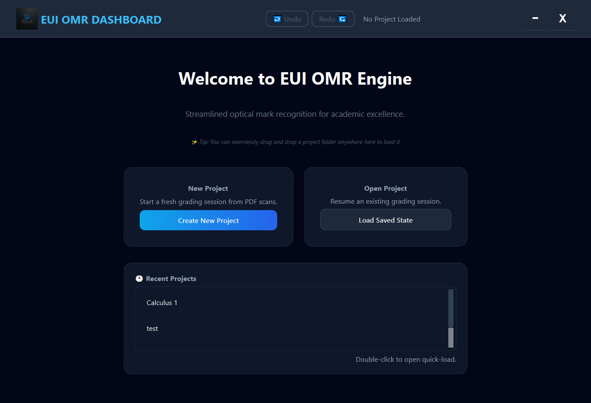
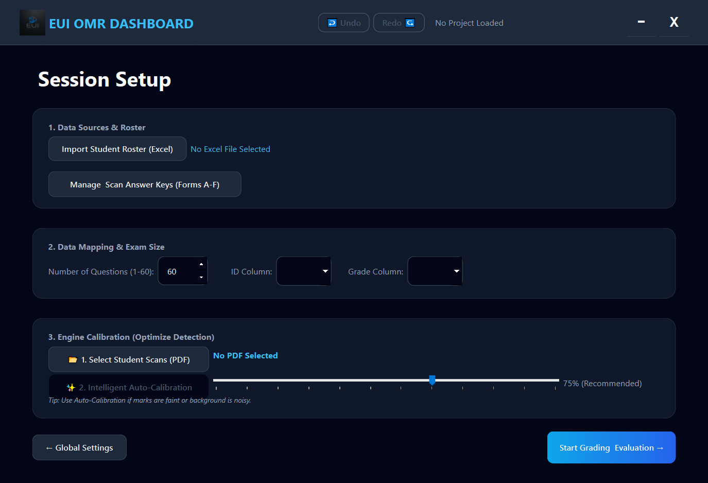
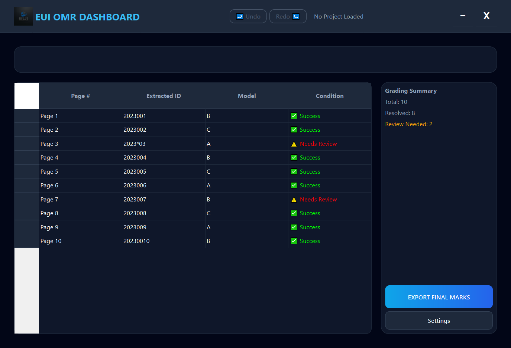

# EUI OMR Engine - Academic Grading & Research Platform

EUI OMR Engine is a professional, independent Optical Mark Recognition (OMR) system designed to eliminate the high costs and logistical constraints of traditional grading hardware. It provides a standardized solution for extracting data from scanned bubble sheets using regular office equipment.

## 📸 Visual Overview

| Welcome & Project Selection | Session Setup & Calibration | Results Dashboard (Dark Mode) |
|:---:|:---:|:---:|
|  |  |  |

## 🎯 The Problem & Our Solution

Traditional OMR systems often trap educational institutions in expensive ecosystems:
- **Requirement for specialized, high-cost paper** and rigid templates.
- **Dependency on proprietary hardware** (OMR scanners) that are expensive to maintain.
- **Inflexible workflows** requiring manual sorting of exam models (Form A/B/C) and manual correction in external spreadsheets.

**EUI OMR Engine** overcomes these limitations by utilizing Computer Vision to process standard A4 paper scanned by any regular office multifunctional printer. It automates model detection, handles page orientation, and provides an integrated environment for data validation.

## 🌟 Key Features

- **Hardware & Media Independence**: Works with standard **A4 paper** and any **document scanner** (PDF output). No specialized hardware required.
- **Automatic Model Detection**: Scans and processes mixed batches of exam versions (e.g., Form A, B, C) simultaneously. The system identifies the model and applies the correct answer key automatically.
- **Intelligent Page Orientation**: Uses image processing to automatically detect and correct page rotation, ensuring accuracy even if sheets are scanned upside-down.
- **Integrated Manual Review**: A dedicated UI for resolving ambiguities (faint marks, ID errors, or version mismatches). Strict validation prevents data export until all flagged items are human-verified.
- **Modern Dashboard UI**: A premium, high-performance interface built with PySide6, featuring Real-time statistics and **Drag & Drop** project loading.
- **Cost-Effective & Independent**: Eliminates per-sheet fees and annual subscription models. The software runs locally, ensuring total data privacy and institutional independence.
- **Data Guard (PDF Mirroring)**: Automatically clones student scans into the project directory to ensure the grading session remains portable and safe.
- **Excel Integration**: Seamlessly maps student data from rosters and exports final marks directly to Excel files.

## 🛠️ Technical Stack
- **Vision**: `opencv-python`, `PyMuPDF` (Computer Vision & PDF Processing)
- **GUI**: `PySide6` (Qt for Python)
- **Data**: `pandas`, `openpyxl` (Excel Automation & Management)
- **Logging**: Python `logging` with persistent file handlers.

## 📁 Project Structure
- `src/core`: OMR Grading Engine, Project Management & Calibration logic.
- `src/ui`: PySide6 Dashboard, Manual Review Modals, and Async Worker threads.
- `src/models`: Data schemas and serialization logic.
- `src/data`: Excel management and grading exports.
- `assets`: Application branding, icons, and logo assets.
- `template.tex`: LaTeX source for the customizable EUI bubble sheet design.

## 🚀 Getting Started

### 1. Installation
Ensure you have Python 3.9+ installed, then install the dependencies:
```bash
pip install -r requirements.txt
```

### 2. Launching the App
Run the main entry point to start the dashboard:
```bash
python main_entry.py
```

### 3. Workflow
1. **Create/Load Project**: Choose a folder to store your grading session. *Note: Project folders are fully portable; you can move them across devices without breaking file links!*
2. **Setup**: Import your student roster (Excel) and define your answer keys (A-F).
3. **Calibrate**: Select the student PDF and run "Intelligent Auto-Calibration" to fine-tune the detection engine.
4. **Dashboard**: Monitor live processing results and perform manual reviews on flagged students.
5. **Export**: Save the final grades back to your Excel roster with one click.

### 4. Building for Production (Standalone Executable)
To distribute the app without requiring Python on the target machine, use the provided PyInstaller spec file:
```bash
pyinstaller EUI_OMR_Engine.spec --clean
```
The compiled executable will be available inside the generated `dist/` directory.

---
*Created for EUI - Empowering Academic Integrity and Efficiency.*
